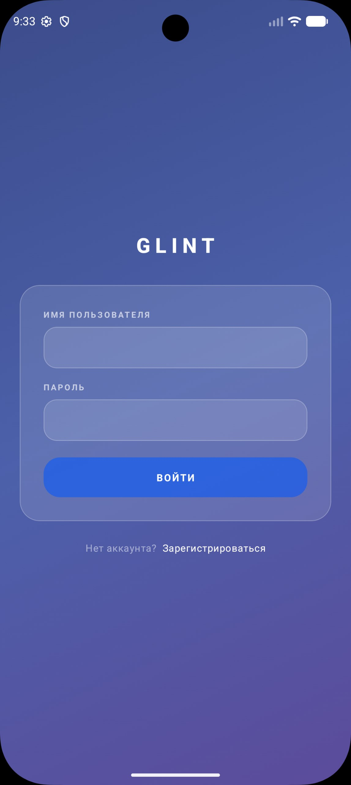
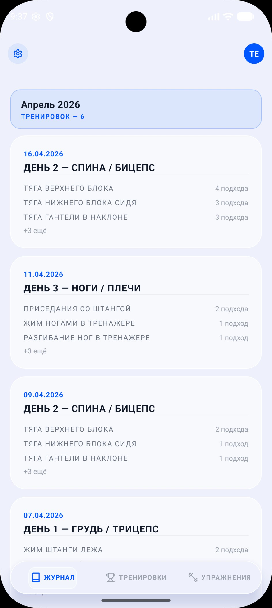
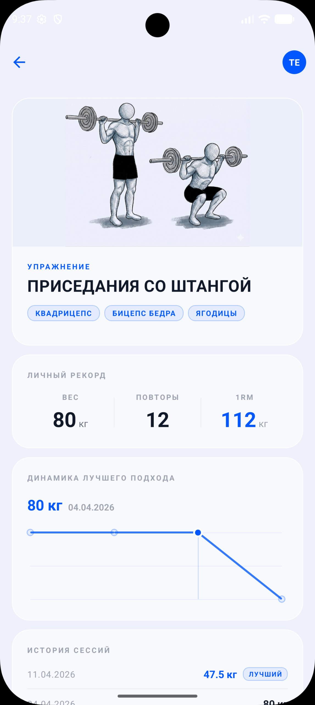
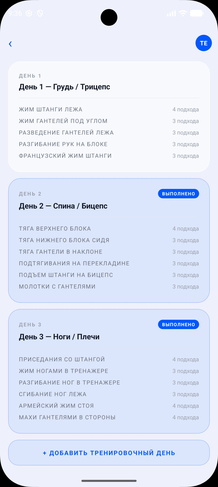
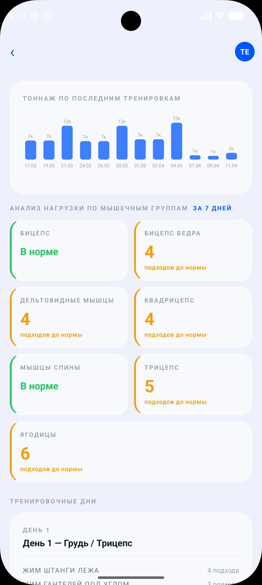
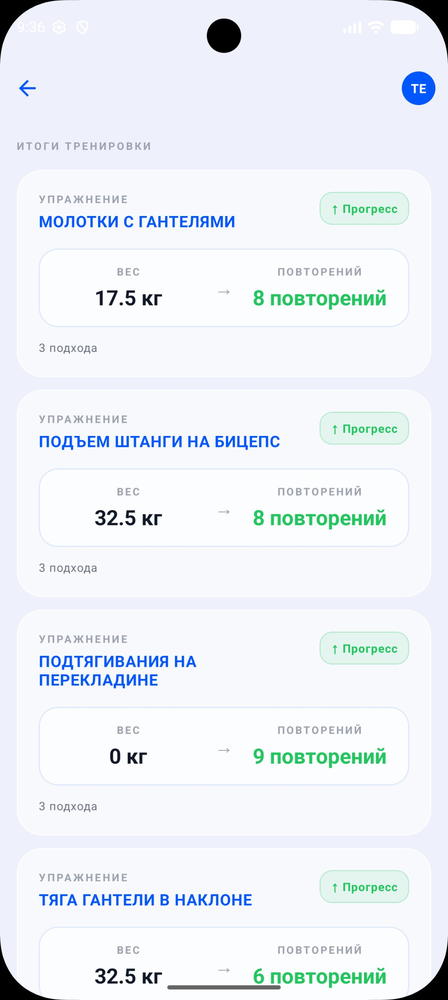

# Fitness Tracking App — Backend

REST API для приложения отслеживания силовых тренировок. В этом репозитории **только серверная часть** (Django + DRF). Мобильный клиент (React Native / Expo) находится в отдельном репозитории.

## Скриншоты клиента

Бэкенд питает мобильный клиент GLINT - ниже видно, какие данные и поведение обеспечивает этот сервис.

<p align="center">
  
  
  
</p>
<p align="center">
  <em>Авторизация &nbsp;·&nbsp;Журнал завершённых тренировок&nbsp;·&nbsp;Карточка упражнения: личный рекорд, 1RM, динамика</em>
</p>

<p align="center">
  
  
  
</p>
<p align="center">
  <em>Дни программы с метками «выполнено»&nbsp;·&nbsp;Тоннаж и анализ MEV/MAV/MRV&nbsp;·&nbsp;Итоги: прогрессия по каждому упражнению</em>
</p>

## Что умеет проект

Бэкенд закрывает три основных сценария тренировочного дневника:

### 1. Свободный дневник тренировок
- Пользователь может стартовать «пустую» тренировку, добавлять в неё упражнения из общего каталога, фиксировать подходы (`вес × повторения`) и отмечать выполненные.
- Каждая тренировка — это `TrainingSession` с привязанными `SessionExercise → SessionSet`. Активные/завершённые сессии разделены флагом `is_active`; одновременно может быть не более одной активной сессии на пользователя.
- При завершении считается `duration_seconds` и сессия уходит в историю.

### 2. Обычные тренировки (Default Programs)
- Это «сохранённые» программы тренировок без алгоритмики: пользователь сам редактирует дни, упражнения, нагрузку и плановые подходы.
- При старте тренировки от шаблона создаётся новая `TrainingSession`, в которую копируются плановые подходы. Любые изменения уходят только в живую сессию, шаблон остаётся неизменным.

### 3. Smart Workout — программы с автопрогрессией
Главная фишка проекта. Программа `SmartProgram` состоит из дней (`SmartDay`), каждый день — из упражнений (`SmartDayExercise`) с плановыми подходами (`SmartSet`, вес × повторы × порядок).

Алгоритм (модуль [`smart_workout/algorithm.py`](smart_workout/algorithm.py)) реализует **double-progression**:
- Если пользователь выполнил все плановые подходы и достиг целевых повторов → программа предлагает увеличить нагрузку.
  - Сначала растут **повторы** (до `REPS_MAX = 12`).
  - При достижении потолка повторов вес идёт вверх (`+2.5 кг` для верха тела, `+5 кг` для низа — детектится по ключевым словам в названии упражнения), а повторы сбрасываются на `REPS_RESET = 6`.
- Если все подходы выполнены, но повторов не хватило → `maintain` (план не меняется).
- Если хотя бы один подход не закрыт → `decrease` (вес снижается).
- Каждые `DELOAD_WEEKS = 4` тренировки одного дня — **deload-неделя**: вес 60 %, объём режется наполовину. Длительный перерыв (`BREAK_DAYS = 10`) сбрасывает счётчик усталости — deload не сработает, если пользователь и так отдыхал.
- Все решения фиксируются в `SmartProgressionLog` (для каждого упражнения: `old_weight`, `new_weight`, `reason`, `sets_completed`, `avg_reps`).

Дополнительно есть **анализ недельного объёма** по группам мышц с порогами **MEV / MAV / MRV** (Israetel / Renaissance Periodization). По каждой группе показывается статус `low | optimal | high | danger` и сколько подходов добавить до оптимума. Если за последние 7 дней были реальные тренировки — считаются фактические выполненные подходы; если нет — плановый объём по подходам.

### Готовые пресет-программы
В [`smart_workout/presets.py`](smart_workout/presets.py) лежат три преднастроенных программы, которые создаются одним запросом:
- `male_split` — базовый 3-дневный сплит (грудь+трицепс / спина+бицепс / ноги+плечи).
- `female_full_body` — женская программа на всё тело.
- `female_lower_body` — женская программа с акцентом на ноги и ягодицы.

## Архитектура

Бэкенд построен на одной центральной идее: **`TrainingSession` — единственное место, где хранится реально выполненная работа**. Откуда она запущена — от шаблона, от smart-программы или вручную — определяет `OneToOne`-ярлык, не сама сессия.

```
TrainingSession ─┬─ default_program_session  (OneToOne → DefaultProgramDay)
                 └─ smart_session            (OneToOne → SmartDay)
                 └─ оба None → свободная тренировка
```

Из этого следует разбиение приложений:

- **`catalog`** — общий справочник упражнений и групп мышц + три абстрактные модели (`BaseProgram`, `BaseNamedOrderedItem`, `BaseWeightSet`), на которые наследуются обе ветки программ. Так у шаблонов(обычных тренировок без "умной прогрессии") и smart-программ одинаковая форма, но разные таблицы и FK.
- **`diary`** — `TrainingSession → SessionExercise → SessionSet` (живые тренировки) и `DefaultProgram*` (пользовательские шаблоны без алгоритмики, фактически «рецепты», подходы из которых копируются в сессию при старте).
- **`smart_workout`** — программы с автопрогрессией. Принципиально разделены:
  - `algorithm.py` — чистая функция без ORM, на вход префетченные объекты, на выход решение.
  - `views.py` — берёт решение, под `transaction.atomic` пишет план (`SmartSet`) и аудит-лог (`SmartProgressionLog`).
  - `presets.py` — данные трёх готовых программ.
- **`users`** — `CustomUser`, JWT-auth с blacklist, троттлинг.
- **`config`** — `.env`-driven settings, корневой `urls.py`.

### Что из этого получается
- Графики, объём, 1RM считаются по `SessionSet` и не различают происхождение тренировки.
- Добавить новый тип программы (например, «от тренера») = новая модель с `OneToOne` на `TrainingSession`. `diary` трогать не нужно.
- Логика прогрессии тестируется без фикстур БД — `algorithm.py` изолирован от слоя данных.

## Аутентификация

- **JWT** через `djangorestframework_simplejwt`. Access-токен — 60 мин, refresh — 14 дней (настраивается в `.env`).
- `ROTATE_REFRESH_TOKENS=True` + `BLACKLIST_AFTER_ROTATION=True` — refresh при обновлении автоматически чёрнится.
- `POST /api/auth/logout/` явно отзывает refresh-токен.
- Login / register / refresh защищены `ScopedRateThrottle` (10/min на логин, 5/min на регистрацию).
- Все защищённые эндпоинты по умолчанию требуют `IsAuthenticated`. Каталог упражнений и группы мышц — публичные (read-only).

## API

| Группа | Префикс |
|---|---|
| Аутентификация | `/api/auth/` |
| Каталог упражнений (публично) | `/api/exercises/`, `/api/muscle-groups/` |
| Свободные / запущенные тренировки | `/api/workouts/`, `/api/workout-exercises/`, `/api/sets/` |
| Шаблоны программ | `/api/default-workouts/`, `/api/default-workout-exercises/`, `/api/default-workout-sets/` |
| Smart-программы и сессии | `/api/smart-workouts/`, `/api/smart-workout-exercises/`, `/api/smart-workout-sets/`, `/api/smart-workout-sessions/` |
| Админка | `/admin/` |

Полный список путей — в `*/urls.py` каждого приложения. Имена путей последовательно используют `template_*`, `program_*`, `day_*`, `session_*`.

## Стек

- **Python 3** + **Django 5+**
- **Django REST Framework**
- **SimpleJWT** (с `token_blacklist`)
- **django-cors-headers**, **django-filter**
- **Pillow** — картинки упражнений
- **python-dotenv** — конфиг из `.env`
- **SQLite** в dev (`db.sqlite3`), **PostgreSQL** через `psycopg2` в проде


## Конфигурация

Все секреты и среда — через `.env` (см. `.env.example`):

| Переменная | Назначение |
|---|---|
| `DJANGO_SECRET_KEY` | Секрет Django (обязательна) |
| `DJANGO_DEBUG` | `True` в dev, `False` в prod |
| `DJANGO_ALLOWED_HOSTS` | Список хостов через запятую |
| `CORS_ALLOWED_ORIGINS` | Allowlist для CORS (в prod — обязательно явный) |
| `JWT_ACCESS_MINUTES` / `JWT_REFRESH_DAYS` | TTL токенов |
| `DB_ENGINE` / `DB_NAME` / `DB_USER` / `DB_PASSWORD` / `DB_HOST` / `DB_PORT` | Параметры БД |
| `DJANGO_SECURE_SSL_REDIRECT` / `DJANGO_HSTS_SECONDS` / `DJANGO_LOG_LEVEL` | Тонкая настройка прод-режима |

В DEBUG-режиме без явного `CORS_ALLOWED_ORIGINS` бэкенд автоматически разрешает все источники, чтобы локальный мобильный клиент / веб мог стучаться без настройки.

## Особенности и инварианты

- **Транзакционность.** Все мульти-write эндпоинты (старт тренировки, финиш smart-сессии, создание пресета, добавление дня/упражнения/подхода) обёрнуты в `transaction.atomic` — частичное состояние при ошибке невозможно.
- **Race-tolerant порядок.** Поля `order` (день, упражнение, подход) проставляются через `Max('order') + 1` под `select_for_update()` — параллельные запросы не получат дубликат.
- **Bulk-операции.** Копирование плановых подходов в живую сессию и пакетная запись прогресс-логов выполняются через `bulk_create` / `bulk_update`.
- **Объём и графики.** Чарты прогресса (`/api/default-workouts/<pk>/`, `/api/smart-workouts/<pk>/`) считаются одним SQL — `annotate(volume=Sum(weight*reps, filter=Q(is_done=True)))`.
- **Изоляция алгоритма.** `calculate_progression()` в `smart_workout/algorithm.py` не делает ORM-запросов — только арифметика по уже префетченным объектам. Это позволяет писать чистые unit-тесты на бизнес-логику.
- **Каталог как seed.** В `catalog/management/commands/seed_catalog.py` лежит команда `python manage.py seed_catalog` — заливает 10 групп мышц и 71 упражнение.

